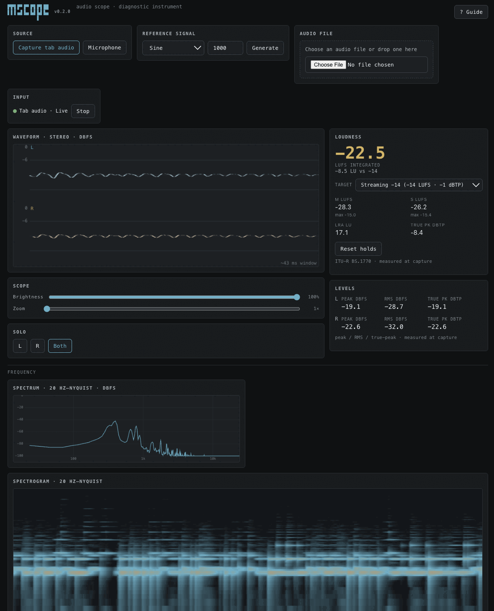

# mscope

A local-first, in-browser **audio scope & diagnostic instrument**.

Point it at a live source and read your signal: oscilloscope, spectrum, loudness, stereo field, and signal-health diagnostics. 

Entirely in the browser. 

An *observational* meter: it never alters the audio it measures.

[](./package.json)
[](./LICENSE)
[](#verification)
[](./tsconfig.json)
[](https://react.dev)
[](https://vite.dev)
[](https://developer.mozilla.org/docs/Web/API/AudioWorklet)
[](https://mscope.mpump.live)



## Highlights

- **Four sources, no upload** — capture another browser tab, the microphone/line in, an audio file, or a built-in test-tone generator. Nothing leaves the page.
- **Lab-bench layout** — a large oscilloscope hero, an always-visible loudness + levels rail, and grouped sections for frequency, stereo field, analysis, and diagnostics.
- **Sample-accurate metering** in an AudioWorklet: peak, RMS, true-peak (dBTP), and ITU-R BS.1770 **LUFS** (momentary / short-term / integrated) with **target compliance**.
- **Deep visual analysis** — spectrum (with tilt, peak-hold, and a cursor readout), spectrogram, ⅓-octave RTA, goniometer, and a loudness/level history graph.
- **Honest by design** — analysis never colours the signal; monitoring is muted by default; the UI is explicit about resampling and that readings are "measured at capture," not lab-grade.
- **Built-in Help** — a Guide button explains every view, metric, and control.

## Run locally

```sh
npm install
npm run dev      # Vite dev server (open the printed localhost URL)
```

Use a Chromium-based desktop browser for tab-audio capture (see [Browser notes](#browser-notes--limitations)).

## Scripts

| Script | Does |
| --- | --- |
| `npm run dev` | Vite dev server. |
| `npm run build` | `tsc -b && vite build` (type-check + production build). |
| `npm test` | Run the Vitest unit suite once. |
| `npm run test:watch` | Vitest in watch mode. |
| `npm run typecheck` | `tsc -b --pretty false`. |
| `npm run lint` | ESLint. |
| `npm run check` | lint + test + build (the full gate). |

## Features

Every view and control, top to bottom.

### Sources
- **Capture tab audio** — `getDisplayMedia()`. Pick a tab and tick **Share tab audio**; mscope verifies an audio track is present. No changes to the source app are needed. *Chromium-based desktop only.*
- **Microphone / line in** — `getUserMedia()` with echo-cancellation / noise-suppression / auto-gain disabled, so you measure the real signal.
- **Audio file** — drop a file on the picker (or browse) to analyze it.
- **Test tone** — sine (set frequency), white, or pink noise, for calibrating or testing a chain.
- **Input status** — idle → requesting → live → ended/error, with a Stop control. If a tab share has no audio track, mscope tells you to re-share with "Share tab audio" enabled.

### Oscilloscope (Waveform)
Stereo time-domain trace on a dBFS scale (0 = full scale; the −6 dBFS guide line is marked). Controls: **Brightness** (trace intensity), **Zoom** (horizontal time-base — shows the latest window/N stretched across the width), and **Solo** (L / R / Both). Freezes the last frame when the source ends.

### Spectrum
Magnitude versus log-frequency (20 Hz → Nyquist), dBFS. **Tilt** adds a slope (e.g. +4.5 dB/oct so pink noise reads flat); **Peak-hold** overlays the running maximum; hovering shows a cursor readout of **frequency · musical note · dB**.

### Spectrogram
A scrolling waterfall — time (x) × frequency (y, log) × magnitude (colour). Reveals sweeps, resonances, noise, and codec artifacts over time.

### RTA
⅓-octave band levels — a quick read on tonal balance.

### Goniometer & Correlation
- **Goniometer** — a stereo vectorscope (mid/side). A near-vertical line ≈ mono; a wide blob ≈ wide stereo; a horizontal tilt ≈ out-of-phase.
- **Correlation** (+1 mono/in-phase, 0 wide, −1 out-of-phase → mono-compatibility risk) and **Balance** (L/R energy).

### Levels
Per channel: **Peak**, **RMS**, and **True-peak** (dBTP, inter-sample, oversampled). The **CLIP** indicator latches when samples reach full scale.

### Loudness
ITU-R BS.1770 / EBU R128, built in-house and verified against EBU Tech 3341 vectors.
- **Integrated** LUFS is the focal number, colour-coded against a chosen **target** (EBU R128 −23, Streaming −14, Apple/Podcast −16, ATSC −24) — pass / over / under.
- **Momentary** (400 ms) and **Short-term** (3 s) with max-holds; **LRA** (loudness range); a latching **TP-OVER** badge when true-peak exceeds the target ceiling (−1 dBTP). **Reset holds** clears them.

### Dynamics & Spectral
- **Dynamics** — Crest factor (peak − RMS), PLR (peak − integrated loudness), Noise floor.
- **Spectral** — Centroid ("brightness"), Flatness (1 ≈ noise, 0 ≈ tonal), Dominant frequency.

### Diagnostics & Histogram
- **Diagnostics** — DC offset, silence / low-signal, sample rate & channel count, cumulative **clip** and **glitch/dropout** counts.
- **Amplitude histogram** — sample-value distribution. Edge spikes = clipping; an off-centre peak = DC bias; gaps = quantization.

### Loudness history
Momentary and short-term LUFS over time against the target line.

### Controls & session
- **Monitor** — audible output, **muted by default** (so capturing a tab doesn't double the audio); it never affects analysis.
- **FFT size / smoothing** — resolution vs responsiveness (window is Blackman, fixed by `AnalyserNode`).
- **A/B snapshot** — hold the current session summary and compare.
- **Reset session** and **Export** the diagnostic report as **JSON** or **Markdown**.

### Help
The **Guide** button (top right) opens an in-app explainer covering every feature above.

## Architecture

React 18 + Vite + TypeScript (strict). One `AudioContext`, created on a user gesture.

```
source → AnalyserNode       → waveform / spectrum / spectrogram / goniometer (visuals)
       → meters AudioWorklet → peak / RMS / true-peak / LUFS / DC / clip / glitch (sample-accurate)
       → monitor gain        → speakers (muted by default)
```

- **Inputs** implement a small `AudioInputSource` contract (`tab-capture`, `microphone`, `audio-file`, `generator`); the engine fans the source out to the analyser, the meters worklet, and the (muted) monitor.
- **Sample-accurate metrics** run in an `AudioWorklet` (`MetersCore`) — gapless, BS.1770-grade. **Visuals** read an `AnalyserNode` on the main thread; spectral/dynamics descriptors derive there too.
- **DSP is dependency-free and unit-tested** (`src/dsp/`): levels, true-peak, loudness, loudness-range, stereo, spectral, dynamics, histogram, glitch.
- The `useScope` hook owns the engine + measurement session and bridges them to the UI.

## Verification

```sh
npm run check   # lint + test + build
```

**313 unit tests** cover all pure DSP and the React hook/components. LUFS is validated against ITU-R BS.1770 / EBU Tech 3341 synthetic vectors. Web-Audio graph behaviour can't run headless — it's covered by the manual checklist below.

## Permissions & privacy

- **Local-only.** No account, no telemetry, no upload, no server-side audio. Report export is a file you download.
- Capture requires a **secure context** (HTTPS or `localhost`) and an explicit browser permission prompt each time; permission is never persisted.
- All audio stays in the page and is discarded when you stop or close the tab.

## Browser notes & limitations

| Source | Support |
| --- | --- |
| Tab audio (`getDisplayMedia`) | **Chromium desktop only** (Chrome/Edge). Firefox ignores display audio; Safari/mobile unsupported. |
| Microphone | All modern browsers. |
| Audio file / test tone | All modern browsers. |

mscope detects capabilities and degrades honestly — the tab-capture button is disabled (with a note) where it can't work. **Measurement caveat:** browsers may resample captured audio, so readings are "measured at capture," not bit-identical to the source and not calibrated/lab-grade.

## Physical-device QA checklist

Headless tests can't prove audible behaviour. Verify in a real browser:

- [ ] Tab capture from a live source; the "no audio track → re-share" hint appears when audio isn't shared.
- [ ] Microphone capture; permission denied / cancelled handled gracefully.
- [ ] Audio-file and test-tone sources play and analyze.
- [ ] Monitor stays silent at the default (no doubled audio / feedback when capturing a tab).
- [ ] Waveform/spectrum/spectrogram render smoothly; brightness/zoom/solo behave.
- [ ] LUFS target compliance colours change as expected; TP-OVER latches; Reset holds clears.
- [ ] Export downloads a valid JSON and Markdown report.
- [ ] `prefers-reduced-motion` pauses animation; keyboard + screen-reader navigation work.

## Repository map

```
src/
  audio/
    AudioContextManager.ts   engine.ts   monitor.ts   meters-core.ts   meters.worklet.ts
    input/                   AudioInputSource + tab / mic / file / generator sources
    analysis/                AnalyserNode wrapper + metric snapshot types
  dsp/                       pure, tested DSP (levels, truePeak, loudness, loudnessRange,
                             stereo, spectral, dynamics, histogram, glitch, util)
  analysis/                  derived-metric + loudness-target types
  state/                     measurement session + JSON/Markdown report
  ui/                        useScope hook + all panels, controls, and the Help guide
  App.tsx  main.tsx  index.css
.github/workflows/           ci.yml (check) + deploy.yml (GitHub Pages)
public/CNAME                 mscope.mpump.live
```

## Deployment

CI (`.github/workflows/ci.yml`) type-checks, lints, tests, and builds on every push and PR. `deploy.yml` publishes `dist/` to GitHub Pages on `main`. The custom domain `mscope.mpump.live` is held by `public/CNAME`. One-time setup: repo **Settings → Pages → Source: GitHub Actions**, and a DNS `CNAME` for `mscope` → `<owner>.github.io`.

## License

[AGPL-3.0-only](./LICENSE). Part of the *mpump* family of local-first browser instruments; audio-engine lineage shared with [mpump](https://mpump.live).
